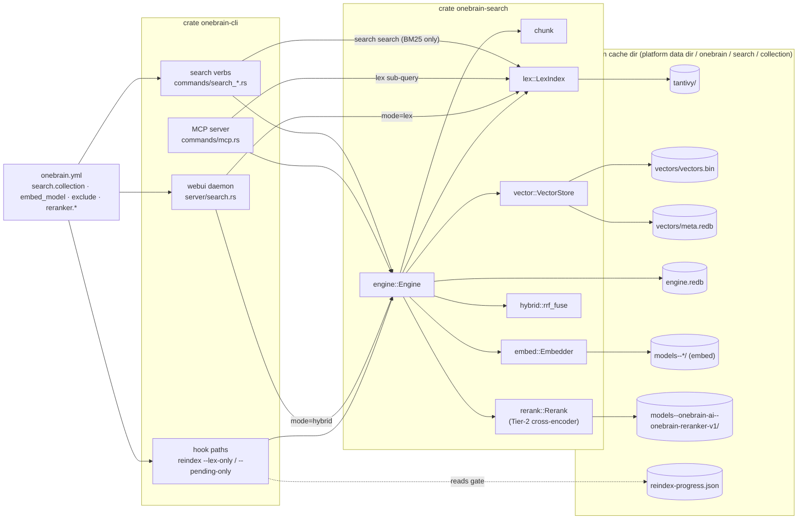
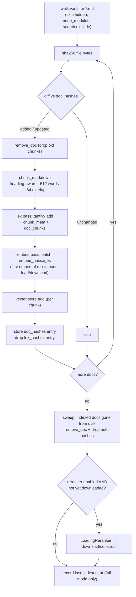
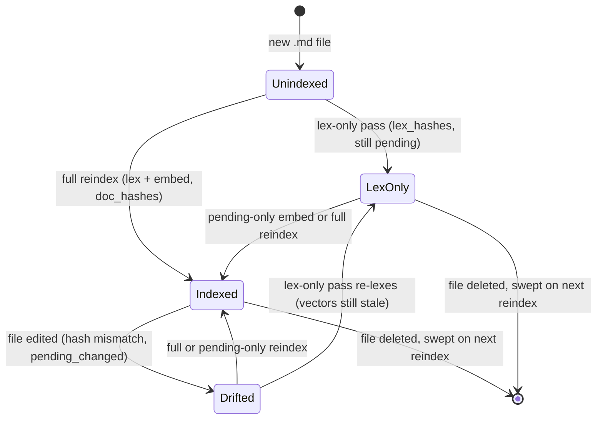
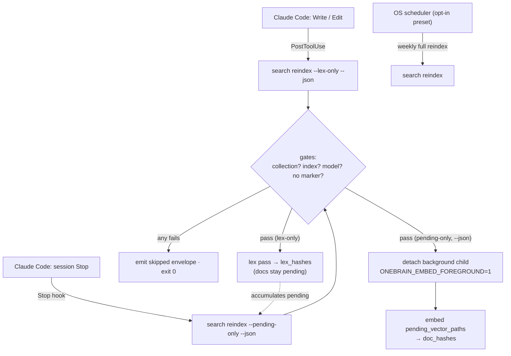
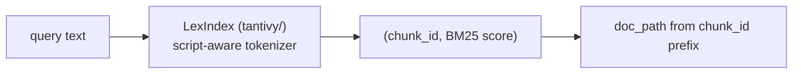
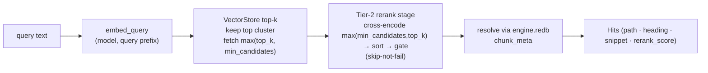
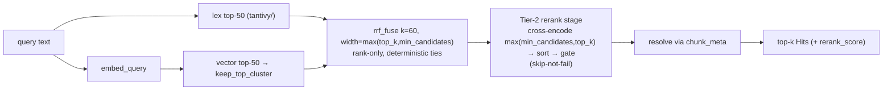
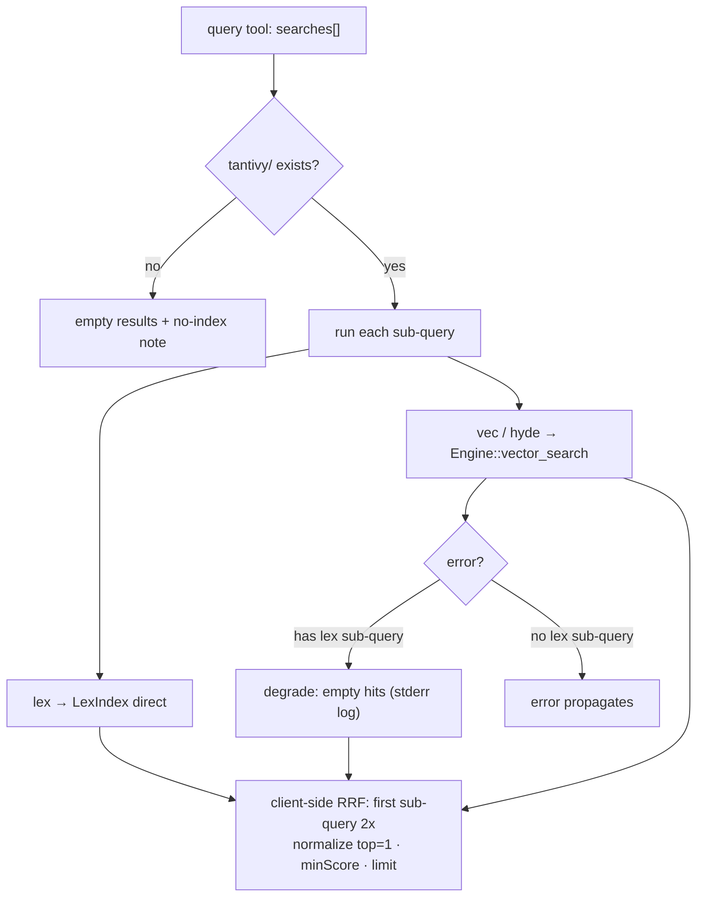

# Search Architecture

The full-process reference for OneBrain's native search system: what's stored on disk, how the
indexing + embedding pipeline works end-to-end, and what every search surface (CLI verbs, MCP
tools, WebUI, hooks) actually touches. This is the *process* view; the crate-internals,
module-by-module reference lives in [`docs/reference/onebrain-search.md`](../reference/onebrain-search.md)
and the MCP server internals in [`docs/reference/mcp.md`](../reference/mcp.md) — this doc
cross-links rather than duplicates them.

Native search replaced the external `qmd` (Node) stack in v3.4.x
([ADR 0012](../decisions/0012-native-search-replace-qmd.md)); `qmd` appears in this doc only as
history (legacy config/alias fallbacks).

Everything below is verified against the source at the cited files. If this doc and the code
disagree, the code wins.

---

## 1. Components & storage map

> Sources: [`crates/onebrain-search/src/lib.rs`](../../crates/onebrain-search/src/lib.rs) ·
> [`crates/onebrain-cli/src/commands/search_common.rs`](../../crates/onebrain-cli/src/commands/search_common.rs) ·
> [`crates/onebrain-search/src/lex.rs`](../../crates/onebrain-search/src/lex.rs) ·
> [`crates/onebrain-search/src/vector.rs`](../../crates/onebrain-search/src/vector.rs) ·
> [`crates/onebrain-search/src/engine.rs`](../../crates/onebrain-search/src/engine.rs) ·
> [`crates/onebrain-search/src/embed.rs`](../../crates/onebrain-search/src/embed.rs)

### Crates

| Crate | Role in search |
|---|---|
| `onebrain-search` | The engine. Seven modules: `chunk` (heading-aware chunker), `lex` (tantivy BM25 + script-aware tokenizer), `embed` (fastembed/ONNX embeddings + model registry), `vector` (flat mmap vector store), `hybrid` (RRF fusion), `rerank` (Tier-2 cross-encoder reranker + registry), `engine` (ties them together). Depends on no other workspace crate. |
| `onebrain-cli` | Every frontend: the `search` verb group (`commands/search_*.rs`), the MCP server (`commands/mcp.rs`), the WebUI daemon search route (`server/search.rs`), and the hook entry points (`search reindex --lex-only` / `--pending-only` in `commands/search_reindex.rs`). Owns collection→cache-dir resolution (`commands/search_common.rs`). |
| `onebrain-core` | Config parsing: `search.collection` / `search.embed_model` / `search.exclude` (+ legacy top-level `qmd_collection` read-fallback) in `src/config.rs`. |
| `onebrain-fs` | Config persistence (`persist_search_key` — atomic write with backup) and hook registration specs (`src/register_hooks/hooks.rs`). |

### Collection cache dir

All engine state lives **outside the vault**, per collection, under the persistent platform data
dir (moved off the OS-purgeable cache dir in v3.4.5 —
[ADR 0021](../decisions/0021-search-state-persistent-data-dir.md), #114/#129). Resolved by
`search_common::search_cache_root()` + `collection_cache_dir()`:

| OS | Path |
|---|---|
| macOS | `~/Library/Application Support/onebrain/search/<collection>/` |
| Linux | `$XDG_DATA_HOME/onebrain/search/<collection>/` (fallback `~/.local/share/…`) |
| Windows | `%APPDATA%\onebrain\search\<collection>\` |

Inside a collection dir:

| Artifact | What it is | Built from | Written by |
|---|---|---|---|
| `tantivy/` | **Lex (BM25) index.** Schema ([`lex.rs::LexIndex::open`](../../crates/onebrain-search/src/lex.rs)): `chunk_id` (STRING, stored), `doc_path` (STRING, stored), `heading_path` (TEXT, stored), `body` (TEXT, script-aware tokenizer, freqs+positions, **not stored**). Thai/Lao/Khmer/Myanmar/CJK runs are character-bigrammed (no dictionary dep); other text gets lowercased word tokens. | Chunk texts from the chunker | `Engine::index_doc` / `remove_doc` (`LexIndex::add/delete/commit`), in both full and lex-only reindex modes |
| `vectors/vectors.bin` | **Semantic index, data file.** Packed little-endian `f32`, row-major, fixed stride = `dims × 4` bytes; row *i* at byte offset `i × dims × 4`. Read via mmap ([`vector.rs`](../../crates/onebrain-search/src/vector.rs)). | One L2-normalized embedding per chunk (`Embed::embed_passages`) | `VectorStore::add`, called by `Engine::index_doc` (full mode) and `Engine::rebuild` |
| `vectors/meta.redb` | **Semantic index, metadata.** redb tables: `chunk_to_row`, `row_to_chunk`, `tombstones`, `free_rows` (recyclable tombstoned slots), `header` (`dims`, append cursor). | — | `VectorStore` |
| `engine.redb` | **Engine metadata** ([`engine.rs`](../../crates/onebrain-search/src/engine.rs)): `chunk_meta` (per-chunk `{doc_path, heading_path, chunk_index, text}` — the *only* place chunk **text** is retrievable: tantivy's `body` field is indexed but not stored, and the vector store keeps no text. Headings are also stored in tantivy, but no search path reads them from there), `doc_chunks` (doc → chunk-id list), `doc_hashes` (per-doc sha256, meaning "vectors current as of this hash"), `lex_hashes` (per-doc sha256 from a lex-only pass — see §2), `engine_header` (`active_model`, `last_indexed_at`). | Doc bytes + chunker output | `Engine` |
| `models--<org>--<repo>/` | Downloaded ONNX embedding models (hf-hub naming via `ModelInfo::cache_dir_name`, e.g. `models--intfloat--multilingual-e5-small`). | Hugging Face download by fastembed | Lazy embedder construction (`Engine::embedder` → `embed::new`) |
| `models--onebrain-ai--onebrain-reranker-v1/` | Downloaded Tier-2 cross-encoder reranker model (same hf-hub cache-dir convention, via `RerankerInfo::cache_dir_name`), sha256-verified once per download (`verify_sha256_once`, cached via a `.sha256-verified` marker next to the model file). | Hugging Face download by the reranker loader | Lazy reranker construction (`Engine::reranker` → `rerank::new`), or eagerly at the end of a full `reindex` when `search.reranker.enabled` and not yet downloaded ([`ReindexProgress::LoadingReranker`]) |
| `reindex-progress.json` | Transient live marker for an in-flight reindex: `{"done":N,"total":M}`. | — | `search reindex` (RAII `LiveProgressFile`, see §4) |

### Embedding model registry

Single source of truth: [`embed.rs::model_registry()`](../../crates/onebrain-search/src/embed.rs).
Default `multilingual-e5-small`.

| Name | Dims | Size | Context | Notes |
|---|---|---|---|---|
| `multilingual-e5-small` | 384 | ~470 MB | 512 | **default** · `query: <text>` / `passage: <text>` prefixes |
| `multilingual-e5-base` | 768 | ~1.1 GB | 512 | e5 prefixes |
| `multilingual-e5-large` | 1024 | ~2.1 GB | 512 | e5 prefixes |
| `bge-m3` | 1024 | ~2.2 GB | 8192 | best Thai accuracy · fp32 · no prefixes |
| `embeddinggemma-300m-q` | 768 | ~310 MB | 2048 | int8 · gemma prompt prefixes |
| `embeddinggemma-300m-q4` | 768 | ~200 MB | 2048 | 4-bit · shares one HF repo/cache dir with `-q` |

Vector hits are trimmed to the **top cluster** — those within `VEC_CLUSTER_WINDOW`
(0.02 cosine) of a query's best score (`engine.rs::keep_top_cluster`), relative to
each query rather than an absolute per-model threshold. This is recall-first: it
never empties a non-empty result set. It **replaced** an absolute per-model
`vec_floor` (0.85 for e5), which straddled genuine e5 match scores (~0.83–0.87)
and silently dropped real matches
([ADR 0024](../decisions/0024-vector-confidence-recall-first.md), superseding the
confidence-floor part of [ADR 0013](../decisions/0013-retrieval-semantics-confidence-gating.md)).

A calibrated cross-encoder reranker — the **Tier-2 rerank stage** — now runs on
top of this cutoff: both `query` (hybrid) and `vsearch` (vector-only) fuse/fetch
a wide candidate block, cross-encode the head of that block against the query
text, sort by the reranker's calibrated 0–1 score, and gate low scorers out —
subject to a never-empty floor (`RERANK_NO_MATCH_KEEP` = 3) that keeps the
invariant above alive one layer up. The default reranker is
`onebrain-reranker-v1` (a `bge-reranker-v2-m3`-based int8 cross-encoder,
multilingual incl. Thai, ~570 MB). Skip-not-fail throughout: no reranker
configured, not downloaded, a lex-only build, or a runtime error all fall back
to the plain fused/vector order with `Hit::rerank_score: None` — a query never
fails, and never returns fewer results, because reranking didn't work. See
[ADR 0025](../decisions/0025-tier2-cross-encoder-reranker.md).

### Config keys (`onebrain.yml`)

> Source: [`crates/onebrain-core/src/config.rs`](../../crates/onebrain-core/src/config.rs)

| Key | Meaning | Default |
|---|---|---|
| `search.collection` | Collection name → cache dir under the search root | auto-generated `<dir>-<hash>` on first use (§4) |
| `search.embed_model` | Active embedding model (registry name) | `multilingual-e5-small` (serde default) |
| `search.exclude` | Vault-relative index-exclusion patterns (path prefixes or bare dir names) | `["attachments"]` |
| `search.reranker.enabled` | Master switch for the Tier-2 cross-encoder rerank stage | `true` (default-on) |
| `search.reranker.model` | Reranker registry name (see [`rerank::reranker_registry`](../reference/onebrain-search.md)) | `onebrain-reranker-v1` |
| `search.reranker.min_candidates` | Minimum fused/retrieved candidate pool cross-encoded per query — a FLOOR, not a ceiling. The engine actually reranks `max(min_candidates, top_k)`, auto-raised so every returned result is always reranked; this value only matters when it exceeds `top_k` (a wider pool than the return size improves quality). Overridable per-query via the CLI's `--min-candidates` / the webui API's `min_candidates` param. | `10` (calibrated) |
| `search.reranker.min_score` | Gate: reranked hits below this calibrated score are dropped (never-empty floor still applies) | `None` → engine's `DEFAULT_RERANK_MIN_SCORE = 0.30` |
| `search.default_top_k` | Vault-level default result count (`top_k`) for a surface that doesn't specify one explicitly (e.g. the webui API's `top_k` param when omitted). Always overridable per-query (CLI `--top-k` / API param). | `10` |
| `qmd_collection` (legacy, top-level) | v3.3-era collection key. Still read as fallback by `load_vault_config`; `onebrain doctor --fix` migrates it to `search.collection` and removes it ([ADR 0016](../decisions/0016-qmd-collection-config-migration.md)). | — |

---

## 2. Indexing + embedding pipeline (write path)

> Sources: [`crates/onebrain-search/src/engine.rs`](../../crates/onebrain-search/src/engine.rs)
> (`reindex_all_with_progress_inner`, `reindex_existing_doc`, `index_doc_mode`) ·
> [`crates/onebrain-search/src/chunk.rs`](../../crates/onebrain-search/src/chunk.rs) ·
> [`crates/onebrain-cli/src/commands/search_reindex.rs`](../../crates/onebrain-cli/src/commands/search_reindex.rs)

### Full reindex (`onebrain search reindex`)

1. **Hook-path detour** — `--lex-only`/`--pending-only` branch off *before* any of the
   machinery below (no prompt, no config mutation; see the hook section).
2. **Model reconcile** — `reconcile_missing_model` drops a stale `search.embed_model` key if the
   configured model's dir was purged from disk (skipped while a reindex marker is live).
3. **First-run model pick** — if *no model chosen yet* (`model_not_chosen`: no physical
   `search.embed_model` key **and** no `models--*` dir on disk): a TTY + text-mode run shows an
   interactive picker (choice persisted to `onebrain.yml` before indexing); non-TTY/structured
   runs silently keep the `multilingual-e5-small` default so headless runs never block.
4. **`--force`** — wipes `tantivy/`, `vectors/`, `engine.redb` (never the downloaded models) so
   everything re-chunks + re-embeds; rejected when combined with explicit paths.
5. **Open engine** — `Engine::open(cache_dir, embed_model)` opens/creates the three stores.
   The embedder is **lazy**: `open` itself never downloads a model.
6. **Live marker** — `LiveProgressFile` creates `reindex-progress.json`; every progress event
   atomically rewrites `{"done":N,"total":M}`; dropping it (any exit) removes the file.
7. **Walk** — `walk_markdown_files`: recursively collect `*.md` only, skipping hidden dirs and
   `node_modules` always, plus `search.exclude` patterns. Nothing else in the vault is ever
   read, chunked, embedded, or stored.
8. **Per doc: hash → diff** — sha256 the file bytes, compare with `doc_hashes`
   (`diff_hash` → Added / Updated / Unchanged). Unchanged docs stop here.
9. **Per changed doc: remove → chunk → index** — `remove_doc` drops all prior chunks (also on
   *Added*, because a prior lex-only pass may have already lex-indexed the doc), then
   `chunk_markdown` splits it along ATX headings into chunks carrying their full
   `heading_path` (`"A > B > C"`), size-bounded at **512 words** with **64-word overlap**
   windows (whitespace-word approximation, not a real tokenizer; `chunk_id` =
   `<doc_path>#<index>`).
10. **Lex pass** — every chunk goes into tantivy (`LexIndex::add`) and its text/heading into
    `chunk_meta`; the doc's chunk-id list into `doc_chunks`.
11. **Embed pass** — all chunk texts of the doc are embedded **in one batch call**
    (`embed_passages`, with the model's passage prefix, L2-normalized). The *first* embed of a
    run emits `ReindexProgress::LoadingModel` — this is where a first-time model download
    (hundreds of MB–GB) or model load happens.
12. **Vector store** — one `VectorStore::add` per chunk (tombstoned rows are recycled via the
    free-list), then the doc's hash is stored into `doc_hashes` (and any `lex_hashes` entry
    dropped — `doc_hashes` is authoritative again).
13. **Removed-doc sweep** — any doc present in `doc_hashes` *or* `lex_hashes` but missing from
    the walk gets `remove_doc` + both hash entries dropped.
14. **Reranker fetch (full reindex only)** — `should_fetch_reranker(enabled, downloaded)`: if
    `search.reranker.enabled` and the configured reranker model isn't already on disk, the engine
    constructs it now (downloading it), emitting `ReindexProgress::LoadingReranker` once, right
    before construction — the reranker-side analogue of step 11's `LoadingModel`. Skipped
    entirely when reranking is disabled, already downloaded, or the model name is unknown to the
    registry; a lex-only build never fires it (no `semantic` feature to load a cross-encoder with).
15. **Finish** — `last_indexed_at` recorded in `engine_header` (full mode only), marker removed,
    summary envelope emitted with before/after index size.

A single failing file is counted (`failed`) and skipped, never aborting the batch. Targeted
reindexes (`search reindex <paths…>`) run the same per-doc logic on just those paths
(`reindex_paths_with_progress`), including per-path removal of now-missing files.

### Incremental drift & pending semantics

`Engine::status` and `Engine::pending_vector_paths` run the same **pure hash walk** a reindex
would (`classify_doc_hashes_drift`) — re-hash every vault `*.md`, compare against `doc_hashes` —
without any indexing side effects and **without ever constructing the embedder**:

- `pending_new` — on disk, no stored hash (a reindex would add it).
- `pending_changed` — stored hash differs (would re-index).
- `pending_removed` — stored hash exists, file gone (would remove).

Pending is defined **purely by `doc_hashes` drift**. That's the trick behind the split passes:

- **`--lex-only`** (`reindex_all_lex_only_with_progress`) updates tantivy + `chunk_meta` and
  records hashes into the separate **`lex_hashes`** table; `doc_hashes` and `last_indexed_at`
  are untouched and the embedder is *never constructed* — so the doc is immediately
  keyword-searchable but keeps reporting as pending until a real embed pass runs. A lex-only
  pass diffs against `lex_hashes` (falling back to `doc_hashes` for docs indexed before the
  table existed — `effective_lex_hash`), so repeated lex-only runs skip unchanged docs.
- **`--pending-only`** embeds exactly `pending_vector_paths()` — the `doc_hashes` drift list
  (added + changed in walk order, then removed, sorted) — via the normal full-mode
  `reindex_paths_with_progress`, which lex-indexes *and* embeds each doc and promotes it into
  `doc_hashes`. Empty worklist → skips before anything expensive (`no-pending`).

### Auto reindex/embed hooks (v3.4.5 Track 4)

> Sources: [`crates/onebrain-fs/src/register_hooks/hooks.rs`](../../crates/onebrain-fs/src/register_hooks/hooks.rs)
> (`HookSpec::REINDEX`, `HookSpec::EMBED`) ·
> [`crates/onebrain-cli/src/commands/search_reindex.rs`](../../crates/onebrain-cli/src/commands/search_reindex.rs)
> (`run_hook_path`)

`onebrain plugin update` (hook registration — `register-hooks` is its hidden legacy alias)
installs two Claude Code hook entries — only when the vault has a search collection configured
(`register_hooks/mod.rs` strips them otherwise). The Stop entry is registered separately from —
and never merged with — the checkpoint Stop hook:

| Trigger | Command | What it does |
|---|---|---|
| **PostToolUse** (after Write/Edit) | `onebrain search reindex --lex-only --json` | Lex-now: incremental keyword pass, synchronous but fast, zero embedder interaction. |
| **Stop** (session end) | `onebrain search reindex --pending-only --json` | Embed-deferred: embeds the accumulated pending docs. In structured mode it **detaches** — re-execs itself as a background child (`ONEBRAIN_EMBED_FOREGROUND=1`, stdio nulled) and returns immediately (`{"detached":true}`), so model load/embed never delays the calling turn. |
| **Scheduled** (safety net, opt-in) | `onebrain qmd-reindex` (hidden legacy alias → full `search reindex`) | The `MaintenancePlus` schedule preset writes a weekly (Sun 03:00) full reindex entry to `onebrain.yml` (`crates/onebrain-fs/src/init/presets.rs`); `onebrain schedule register` installs it into the OS scheduler. |

Both hook flags share one contract (`run_hook_path`): **never prompt, never mutate config, never
fail the calling turn.** Every gate failure or runtime error emits an ok-envelope
`{"skipped":true,"reason":…}` and exits 0. The gates, in order:

1. `no-collection` — vault/collection unresolvable. Hooks use the **read-only** resolver
   (`collection_name_readonly`) — they never persist an auto-generated collection name. Past
   the gates, the progress marker is built from the gate's already-resolved cache dir
   (`LiveProgressFile::in_cache_dir`), so no part of the hook path re-resolves via the
   persisting `collection_for`.
2. `no-index` — `<cache_dir>/tantivy/` doesn't exist yet (the user hasn't run a first reindex).
3. `model-not-downloaded` — the configured model's `models--*` dir is absent. Applies to *both*
   flags (even `--lex-only`, which needs no model) so a hook can never race a foreground
   first-run download.
4. `reindex-in-flight` — a fresh `reindex-progress.json` marker exists (§4).

Additional skip reasons past the gates: `no-pending` (empty worklist), `detach-failed`,
`semantic-unavailable` (lex-only build), `error` (any engine failure, logged to stderr).

### Model download lifecycle

The embedder is constructed lazily (`Engine::embedder`, the only call site of `embed::new`), so
a model download can only happen on paths that actually embed:

- **Can download**: full `search reindex` (the expected first-download point — TTY runs get the
  first-run picker; headless runs default to `multilingual-e5-small`), `--pending-only` past its
  gates (gate 3 means the model is already on disk, so in practice it only *loads*),
  `search query` / `search vsearch` first use, `search model set` (explicit switch →
  `Engine::rebuild` re-embeds every chunk from `chunk_meta` at the new dims), MCP `vec`/`hyde`
  sub-queries, and WebUI `mode=hybrid` on a populated index.
- **Never downloads**: `search search` (never opens the engine), `search get`, `search status`,
  `search model list` (pure-fs `model_download_status`), hook paths before their gates, and
  `Engine::open` itself.

---

## 3. Search modes (read paths)

### `onebrain search search` — keyword (BM25)

> Source: [`crates/onebrain-cli/src/commands/search_query.rs`](../../crates/onebrain-cli/src/commands/search_query.rs) (`run_lex`)

| Artifact | Touched |
|---|---|
| `tantivy/` | ✅ read (via `LexIndex::open` — created empty if absent) |
| `vectors/*`, `engine.redb`, `models--*` | ❌ never |
| `onebrain.yml` | read; **may persist** an auto-generated `search.collection` on first run (§4) |

Flow: resolve collection → open `LexIndex` directly (deliberately *not* `Engine::open`, so no
embedder ever exists) → BM25 search (raw tantivy scores; `--min-score` filters on them) →
results carry `chunk_id` + a `doc_path` parsed from the chunk-id prefix (`<doc_path>#N`);
`heading_path`/`snippet` are left empty rather than guessed, because chunk text lives only in
`engine.redb`, which this verb never opens.

### `onebrain search vsearch` — semantic (vector-only)

> Sources: `search_query.rs` (`run_vsearch`) · `engine.rs` (`Engine::vector_search`)

| Artifact | Touched |
|---|---|
| `vectors/vectors.bin` + `meta.redb` | ✅ scanned (exact cosine top-k, mmap + simsimd dot) |
| `engine.redb` | ✅ read (`chunk_meta` → doc/heading/snippet, and again for rerank passage text) |
| `models--*` (embed) | ✅ embedder loads active model (downloads on first use) |
| `models--onebrain-ai--onebrain-reranker-v1/` | ✅ if `search.reranker.enabled` and downloaded — loads lazily on first reranked query |
| `tantivy/` | ❌ |

Flow: open engine → embed the query (`embed_query`, model's query prefix) → vector store scan →
keep the top cluster (`keep_top_cluster`, within 0.02 of the best score), fetched at
`max(top_k, min_candidates)` so the rerank stage has a full pool to work with → **Tier-2 rerank
stage** (`apply_rerank`, [ADR 0025](../decisions/0025-tier2-cross-encoder-reranker.md)):
cross-encode the reranked pool — `max(min_candidates, top_k)` entries, a FLOOR of
`min_candidates` auto-raised to cover `top_k` so every returned result is always reranked —
against the query text, sort by calibrated score, gate at `min_score` (never-empty floor keeps
the top 3 on total rejection), append the unreranked fused tail (dropped by the final truncation
to `top_k` — it never appears in the returned set) → resolve chunk ids to `Hit`s (doc path,
heading path, 200-char snippet, `rerank_score`) from `chunk_meta`. Skip-not-fail: no reranker
configured/downloaded, a lex-only build, or a runtime rerank error all fall back to the plain
vector order with `rerank_score: None` on every hit — the CLI then surfaces an explicit
"unreranked" hint rather than silently looking confident. A non-empty but low-confidence
*unreranked* result additionally attaches the pre-reranker cosine hint (`vec_confidence_hint`);
an empty result attaches an `index_hint` ("index is empty…" / "index is behind — N doc(s) not
yet indexed") from a best-effort status probe. In a **lex-only build** this verb errors with
`SEMANTIC_UNAVAILABLE` (no lex analogue to degrade to).

### `onebrain search query` — hybrid (RRF)

> Sources: `search_query.rs` (`run_query`) · `engine.rs` (`Engine::query`) ·
> [`crates/onebrain-search/src/hybrid.rs`](../../crates/onebrain-search/src/hybrid.rs)

| Artifact | Touched |
|---|---|
| `tantivy/` | ✅ lex leg (top 50) |
| `vectors/*` | ✅ vector leg (top 50, trimmed to top cluster via `keep_top_cluster`) |
| `engine.redb` | ✅ resolve fused hits, and again for rerank passage text |
| `models--*` (embed) | ✅ query embedding |
| `models--onebrain-ai--onebrain-reranker-v1/` | ✅ if `search.reranker.enabled` and downloaded — loads lazily on first reranked query |

Flow: both legs run inside `Engine::query` — lex top-50 and vector top-50 (the vector leg trimmed as noted in the table above) — then
`rrf_fuse` combines them by **rank only** (each list contributes `1/(60 + rank)`; scores summed,
ties broken by chunk id for determinism). The fuse width is `max(--top-k, search.reranker.min_candidates)`
— wider than the caller's requested `top_k` — so the **Tier-2 rerank stage** (`apply_rerank`,
[ADR 0025](../decisions/0025-tier2-cross-encoder-reranker.md)) always sees a full reranked pool:
cross-encode `max(min_candidates, top_k)` entries (`min_candidates` is a FLOOR, auto-raised to
cover `top_k` — every returned result is always reranked) against the query text, sort by
calibrated score, gate at `min_score` (never-empty floor), append the unreranked fused tail
(dropped by the truncation below — it never appears in the returned set), truncate to `--top-k`,
resolve via `chunk_meta`. `--min-score` filters on the fused RRF score — a **separate** knob from
the rerank gate (`search.reranker.min_score`), which operates on the cross-encoder's calibrated
score instead. In a **lex-only build**, hybrid degrades to `run_lex` with a one-line stderr notice
(the rerank stage never runs — no embedder, no fused vec leg to rerank).

### `onebrain search get`

> Source: [`crates/onebrain-cli/src/commands/search_get.rs`](../../crates/onebrain-cli/src/commands/search_get.rs) · `engine.rs` (`Engine::get`)

| Artifact | Touched |
|---|---|
| `engine.redb` | ✅ (`doc_chunks` → `chunk_meta`, concatenated in chunk order) |
| everything else | ❌ |

Returns the doc's **stored** text (its chunks joined with blank lines) — the index's view of the
doc, not a live file read. Errors with "doc not found" for un-indexed paths. Never embeds.

### MCP tools (`onebrain mcp`)

> Sources: [`crates/onebrain-cli/src/commands/mcp.rs`](../../crates/onebrain-cli/src/commands/mcp.rs) ·
> [`docs/reference/mcp.md`](../reference/mcp.md)

The MCP server holds one `Arc<Mutex<Engine>>`; every engine call crosses the async boundary via
`tokio::task::spawn_blocking` (the engine itself is synchronous). Four tools:

**`query`** — typed sub-queries, fused client-side (this RRF lives in `mcp.rs`, *not* the
engine's — it fuses N weighted sub-query result lists, normalizing the top score to 1.0):

| Sub-query type | Engine path | Artifacts |
|---|---|---|
| `lex` | direct `LexIndex::open` (same as `search search` — never the embedder) | `tantivy/` only |
| `vec` | `Engine::vector_search` (includes the Tier-2 rerank stage — see §3's `vsearch` section) | `vectors/*` + `engine.redb` + model + reranker |
| `hyde` | `Engine::vector_search` on a client-written *hypothetical answer passage* (the server treats it identically to `vec` — the HyDE trick is the caller's prompt-side job) | same as `vec` |

Rules (all in `mcp.rs`): 1–10 sub-queries; the **first sub-query gets 2× weight**; each list
contributes `weight / (60 + rank + 1)` (0-based `rank`). This is a **deliberately separate**
fusion from the engine's hybrid `rrf_fuse` in §3 (`1 / (60 + rank)`) — it adds per-sub-query
weights and a `+1` on the rank term, and normalizes the top hit to 1.0; the two are intentionally
NOT unified (see the note in `mcp.rs`). Internal fetch depth is `max(limit,10) × 3`;
`minScore` filters on the normalized score. **Degradation**: if at least one `lex` sub-query is
present, any `vec`/`hyde` error (lex-only build, model failure mid-query) degrades that
sub-query to empty hits with a stderr log; with no lex sub-query the error propagates. **No
index** (`tantivy/` missing): returns empty results plus the note
"No search index for this vault yet — run `onebrain search reindex`, or fall back to filesystem
search (grep/Read)." — the qmd-compat params `candidateLimit`/`collections`/`intent` are accepted
but unused; `rerank: Option<bool>` is likewise deserialize-only and **not** a per-request toggle —
now that native reranking is genuinely implemented ([ADR 0025](../decisions/0025-tier2-cross-encoder-reranker.md)),
`vec`/`hyde` sub-queries rerank (or don't) according to the vault's `search.reranker.enabled`
config, not this request field. Each `QueryHit` carries `rerank_score` (present only when the
engine actually reranked that hit — see [`docs/reference/mcp.md`](../reference/mcp.md)).

**`get` / `multi_get`** — **direct vault file reads** (`tokio::fs::read_to_string` after
confining the path under the vault root); the index is not involved at all, so they work with no
index and no model. `get` supports `path:N` line suffixes + windowing; `multi_get` takes a glob
or comma list, skips files over `maxBytes` (default 10240), and excludes dot-dirs from glob
walks. Note the asymmetry with CLI `search get`, which reads the *index's* stored text instead.

**`status`** — same payload as `search status` (via `status_data_for` on the already-open
engine).

### WebUI — `GET /api/vault/search`

> Source: [`crates/onebrain-cli/src/server/search.rs`](../../crates/onebrain-cli/src/server/search.rs)

Params: `q` (required), `mode` (`lex` default; anything other than `hybrid` means lex). Native
since Track 2 — same index, same engine paths as the CLI. Uses the **read-only** collection
resolver (never persists config), caps at top-20 (legacy qmd parity), runs the search in
`spawn_blocking` under a 30 s timeout, and returns `{hits: [{path, score, title, snippet}], mode}`.

| Mode | Path | Artifacts |
|---|---|---|
| `lex` | `LexIndex` direct (title = file stem, empty snippet) | `tantivy/` |
| `hybrid` | `Engine::query` (title = heading path if present; real snippets) | all four artifacts + model |

Degradation: missing `tantivy/` → `200` with empty hits (never an error; hybrid short-circuits
before touching the engine). `doc_count == 0` → hybrid returns empty without embedding (no model
download on an empty index). Lex-only build → `mode=hybrid` silently runs the lex path.

### `onebrain search status`

> Source: [`crates/onebrain-cli/src/commands/search_status.rs`](../../crates/onebrain-cli/src/commands/search_status.rs)

Reads, in order: pure-fs model/index sizes (*before* opening the engine, because `Engine::open`
creates an empty cache dir as a side effect), the live `reindex-progress.json` marker, then a
read-only engine open + `Engine::status` drift walk (honouring `search.exclude`). Never
downloads. Key fields: `indexed` = **`doc_count > 0`** (not "cache dir exists" — an empty dir
left by a status probe must not read as indexed), `current_model_missing` = semantic build +
collection set + active model's dir absent, `pending_new/changed/removed`, `last_indexed_at`,
`reindexing {done,total}` when a marker is live, `semantic_available` =
compile-time `semantic` feature.

**Reranker fields** (rendered under a separate "🎯 Reranker" section in text mode):
`reranker_model` (configured `search.reranker.model` name), `reranker_ready` (config-and-filesystem
check: `search.reranker.enabled` AND the model's `models--*` dir present — never opens/loads the
model itself), `reranker_downloaded` (pure filesystem presence check, independent of
`enabled` — matches the vocabulary `doctor` and the daemon's `/api/internal/status` use), and
`reranker_disk_bytes` (on-disk size of the downloaded reranker dir, `None` if absent).

### Degradation matrix

| Mode | No index yet | Model missing | Lex-only build ([ADR 0017](../decisions/0017-platform-tiered-semantic-search.md)) | Reindex in flight |
|---|---|---|---|---|
| `search search` | empty results (opens/creates empty tantivy) | unaffected | works (its whole point) | works (last committed tantivy state) |
| `search vsearch` | 0 hits + `index_hint` (embeds query first — may download) | downloads on use | **error** `SEMANTIC_UNAVAILABLE` | works (reads current stores) |
| `search query` | 0 hits + `index_hint` (embeds query first) | downloads on use | degrades to lex + stderr notice | works |
| `search get` | "doc not found" error | unaffected | works | works |
| MCP `query` | empty + "No search index…" note (no engine touched) | `vec`/`hyde` may attempt download; on failure degrade-to-empty if a `lex` sub-query exists, else error | `lex` works; `vec`/`hyde` degrade/error by the same rule | works |
| MCP `get`/`multi_get` | works (direct file reads) | unaffected | works | works |
| WebUI `lex` | empty hits, 200 | unaffected | works | works |
| WebUI `hybrid` | empty hits, 200 (short-circuit) | may download in-daemon; embed failure → 500 | silently runs lex path | works |
| `search status` | `indexed:false`, zero counts | `current_model_missing:true` | `semantic_available:false` | reports `reindexing{done,total}`; counts may lag |
| reranker (all semantic verbs) | n/a (reranks whatever candidates exist) | not downloaded → `rerank_score:None` on every hit + CLI "unreranked" hint (skip-not-fail; never errors) | never runs (no `semantic` feature) | works (reranks against the current committed index) |
| hook `--lex-only`/`--pending-only` | skip `no-index` | skip `model-not-downloaded` | both flags normally skip `model-not-downloaded` (nothing ever downloads in this build); if a model dir exists from a prior semantic build, lex-only runs and pending-only skips `semantic-unavailable` | skip `reindex-in-flight` |

---

## 4. Cross-cutting

### Collection resolution

> Source: [`crates/onebrain-cli/src/commands/search_common.rs`](../../crates/onebrain-cli/src/commands/search_common.rs)

`collection_for`: use `search.collection` if configured (else the legacy `qmd_collection`
fallback via `load_vault_config`); otherwise auto-generate **`<vault-dir-name>-<hash>`** — the
hash being the first 6 hex chars of sha256 of the vault's absolute path
(`engine::short_path_hash`) — and **persist it** to `onebrain.yml` (atomic write with backup via
`onebrain_fs::persist_search_key`). Deterministic per path, stable once written, headless-safe.
All CLI `search` verbs (including read paths) resolve through this and may therefore persist the
key on first use; the two surfaces that must never mutate config — the WebUI route and the hook
paths — use `collection_name_readonly`, which derives the *same* name without persisting, so a
pre-reindex WebUI search and the eventual first reindex agree on the collection.

### Concurrency & the progress marker

> Sources: `search_common.rs` (`reindex_progress_path`, `read_reindex_progress`) ·
> `search_reindex.rs` (`LiveProgressFile`)

- The marker `reindex-progress.json` is RAII-managed: created at reindex start, atomically
  rewritten per progress event, removed on drop (success *or* failure).
- Readers treat a marker older than **30 minutes** as a crash leftover: ignored and
  best-effort deleted.
- Gate 4 makes hook reindexes yield to any in-flight run; `search status` surfaces the live
  `(done,total)`; `reconcile_missing_model` also no-ops while a marker is live (a mid-download
  model dir is legitimately absent).
- The Stop hook's detached child re-runs the full gate chain itself, so parent/child races
  collapse into a skip.
- Read paths are never blocked: tantivy readers see the last committed state, and redb gives
  MVCC snapshots.

### Platform notes

- The cache root honours the `ONEBRAIN_CACHE_DIR` test override and shares
  `migration::default_state_dir` with the rest of the CLI's persistent state.
- Release targets without an ONNX Runtime prebuilt ship a **lex-only build**
  (`--no-default-features`; [ADR 0017](../decisions/0017-platform-tiered-semantic-search.md),
  [ADR 0020](../decisions/0020-cpu-only-embedding-runtime.md)): keyword search, chunking, the
  vector store and the whole index lifecycle compile everywhere; only embedding is stubbed
  (`SEMANTIC_UNAVAILABLE`). See the per-mode behavior in the degradation matrix.
- Thai (and Lao/Khmer/Myanmar/CJK) keyword search uses character bigrams — no dictionary asset
  — with real word segmentation (nlpo3 et al.) deferred; the vector side carries Thai semantics
  meanwhile (`lex.rs` module docs).

## Related docs

- [`docs/reference/onebrain-search.md`](../reference/onebrain-search.md) — crate internals,
  module by module (schemas, tombstone/free-list mechanics, tokenizer details).
- [`docs/reference/mcp.md`](../reference/mcp.md) — MCP server internals.
- ADRs: [0012](../decisions/0012-native-search-replace-qmd.md) (native search),
  [0013](../decisions/0013-retrieval-semantics-confidence-gating.md) (confidence gating),
  [0014](../decisions/0014-index-scope-and-exclusion.md) (index scope/exclusion),
  [0016](../decisions/0016-qmd-collection-config-migration.md) (config migration),
  [0017](../decisions/0017-platform-tiered-semantic-search.md) (platform tiers),
  [0019](../decisions/0019-native-mcp-server-staged-qmd-cutover.md) (MCP cutover),
  [0020](../decisions/0020-cpu-only-embedding-runtime.md) (CPU-only runtime),
  [0021](../decisions/0021-search-state-persistent-data-dir.md) (persistent data dir),
  [0024](../decisions/0024-vector-confidence-recall-first.md) (recall-first vector cutoff),
  [0025](../decisions/0025-tier2-cross-encoder-reranker.md) (Tier-2 cross-encoder reranker).
